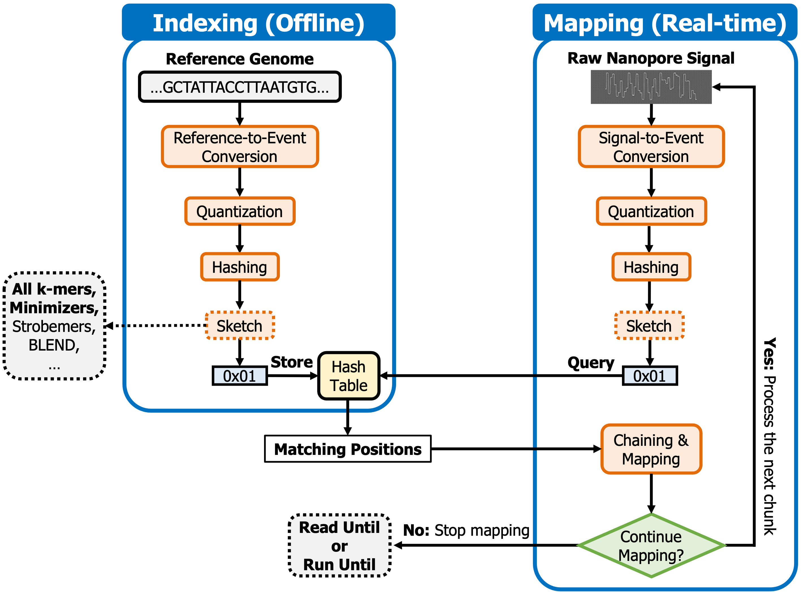

# RawHash

RawHash is a hash-based mechanism to map raw nanopore signals to a reference genome in real-time. To achieve this, it 1) generates an index from the reference genome and 2) efficiently and accurately maps the raw signals to the reference genome such that it can match the throughput of nanopore sequencing even when analyzing large genomes (e.g., human genome.

Below figure shows the overview of the steps that RawHash takes to find matching regions between a reference genome and a raw nanopore signal.

<p align="center" width="100%">
    
</p>

To efficiently identify similarities between a reference genome and reads, RawHash has two steps, similar to regular read mapping tools, 1) indexing and 2) mapping. The indexing step generates hash values from the expected signal representation of a reference genome and stores them in a hash table. In the mapping step, RawHash generates the hash values from raw signals and queries the hash table generated in the indexing step to find seed matches. To map the raw signal to a reference genome, RawHash performs chaining over the seed matches.

RawHash can be used to map reads from **FAST5 or POD5** files to a reference genome in sequence format. We will provide the support for using SLOW5 files.

RawHash performs real-time mapping of nanopore raw signals. When the prefix of reads in FAST5 or POD5 file can be mapped to a reference genome, RawHash will stop mapping and provide the mapping information in PAF format. We follow the similar PAF template used in [UNCALLED](https://github.com/skovaka/UNCALLED) and [Sigmap](https://github.com/haowenz/sigmap) to report the mapping information.

# Recent changes

* RawHash now supports **POD5** files. RawHash will automatically detect the POD5 files from the file prefix (i.e., ".pod5"). Note: This feature is tested only on the Linux systems.

# Installation

* Clone the code from its GitHub repository (`--recursive` must be used):

```bash
git clone --recursive https://github.com/CMU-SAFARI/RawHash.git rawhash
```

* Compile (Make sure you have a C++ compiler and GNU make):

```bash
cd rawhash && make
```

If the compilation is successful, the binary will be in `bin/rawhash`.


# Usage

## Getting help

You can print the help message to learn how to use `rawhash`:

```bash
rawhash
```

## Indexing
Indexing is similar to minimap2's usage. We additionally include the pore models located under ./extern

Below is an example that generates an index file `ref.ind` for the reference genome `ref.fasta` using a certain k-mer model located under `extern` and `32` threads.

```bash
rawhash -d ref.ind -p extern/kmer_models/r9.4_180mv_450bps_6mer/template_median68pA.model -t 32 ref.fasta
```

Note that you can directly jump to mapping without creating the index because RawHash is able to generate the index relatively quickly on-the-fly within the mapping step. However, a real-time genome analysis application may still prefer generating the indexing before the mapping step. Thus, we suggest creating the index before the mapping step.

## Mapping

It is possible to provide inputs as FAST5 files from multiple directories. It is also possible to provide a list of files matching a certain pattern such as `test/data/contamination/fast5_files/Min*.fast5`

* Example usage where multiple files matching a certain the pattern `test/data/contamination/fast5_files/Min*.fast5` and fast5 files inside the `test/data/d1_sars-cov-2_r94/fast5_files` directory are inputted to rawhash using `32` threads and the previously generated `ref.ind` index:

```bash
rawhash -t 32 ref.ind test/data/contamination/fast5_files/Min*.fast5 test/data/d1_sars-cov-2_r94/fast5_files > mapping.paf
```

* Another example usage where 1) we only input a directory including FAST5 files as set of raw signals and 2) the output is directly saved in a file.

```bash
rawhash -t 32 -o mapping.paf ref.ind test/data/d1_sars-cov-2_r94/fast5_files
```

**IMPORTANT** if there are many fast5 files that rawhash needs to process (e.g., thousands of them), we suggest that you specify **only** the directories that contain these fast5 files

RawHash also provides a set of default parameters that can be preset automatically.

* Mapping reads to a viral reference genome using its corresponding preset:

```
rawhash -t 32 -x viral ref.ind test/data/d1_sars-cov-2_r94/fast5_files > mapping.paf
```

* Mapping reads to small reference genomes (<50M bases) using its corresponding preset:

```
rawhash -t 32 -x sensitive ref.ind test/data/d1_sars-cov-2_r94/fast5_files > mapping.paf
```

* Mapping reads to large reference genomes (>50M bases) using its corresponding preset:

```
rawhash -t 32 -x fast ref.ind test/data/d1_sars-cov-2_r94/fast5_files > mapping.paf
```

* Although we have not thoroguhly evaluated, RawHash also provides another set of default parameters that can be used for very large metagenomic samples (>10G). To achieve efficient search, it uses the minimizer seeding in this parameter setting. This setting is not evaluated in our manuscript.

```
rawhash -t 32 -x faster ref.ind test/data/d1_sars-cov-2_r94/fast5_files > mapping.paf
```

The output will be saved to `mapping.paf` in a modified PAF format used by [Uncalled](https://github.com/skovaka/UNCALLED).

## Potential issues you may encounter during mapping

It is possible that your reads in fast5 files are compressed with the [VBZ compression](https://github.com/nanoporetech/vbz_compression) from Nanopore. Then you have to download the proper HDF5 plugin from [here](https://github.com/nanoporetech/vbz_compression/releases) and make sure it can be found by your HDF5 library:
```bash
export HDF5_PLUGIN_PATH=/path/to/hdf5/plugins/lib
```

If you have conda you can simply install the following package (`ont_vbz_hdf_plugin`) in your environment and use rawhash while the environment is active:

```bash
conda install ont_vbz_hdf_plugin
```
# Reproducing the results

Please follow the instructions in the [README](test/README.md) file in [test](./test/).

# Upcoming Features

* Support for reading SLOW5 Files.
* Direct integration with the Read Until API.
* Ability to specify even/odd channels to eject the reads only from these specified channels.
* Please create issues if you want to see more features that can make RawHash easily integratable with nanopore sequencers for any use case.

# Citing RawHash

To cite RawHash, you can use the following BibTeX:

```bibtex
@article{firtina_rawhash_2023,
	title = {{RawHash}: {Enabling} {Fast} and {Accurate} {Real}-{Time} {Analysis} of {Raw} {Nanopore} {Signals} for {Large} {Genomes}},
	doi = {10.1101/2023.01.22.525080},
	journal = {bioRxiv},
	author = {Firtina, Can and Ghiasi, Nika Mansouri and Lindegger, Joel and Singh, Gagandeep and Cavlak, Meryem Banu and Mao, Haiyu and Mutlu, Onur},
	month = jan,
	year = {2023},
	pages = {2023.01.22.525080},
}
```
